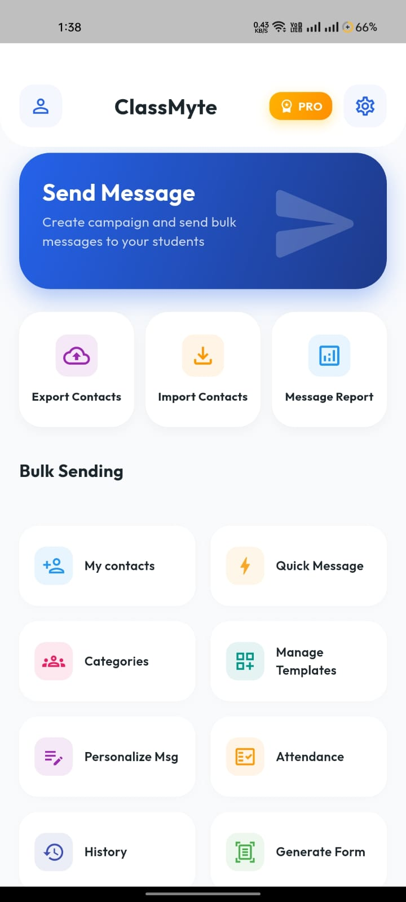
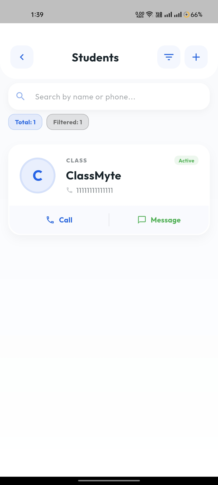
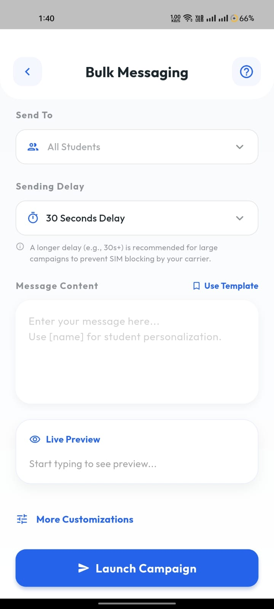

<h1 align="center">ClassMyte 📲</h1>

  <b>Send Bulk SMS using your SIM — No API, No Extra Cost</b>

  ✔️ Uses your SIM & SMS bundles  
  ✔️ No expensive APIs  
  ✔️ No per-message cost  

---

## 📥 Download

  

  <i>⚠️ Enable "Install from Unknown Sources" before installing</i>

---

## 🚀 What is ClassMyte?

ClassMyte is a smart bulk SMS app that lets you send **hundreds or thousands of messages using your own SIM card** — just like normal texting, but automated.

Unlike traditional tools that rely on paid services like Twilio, ClassMyte works directly through your phone.

---

## 🔥 Why Use ClassMyte?

- **Save money** — use your SMS bundles instead of paying per message  
- **Direct delivery** — messages sent via your SIM  
- **Fast & reliable** — no external dependency  
- **Smart delay system** — reduces SIM blocking  

---

## 📸 Screenshots

  
  
  

---

## ✨ Features

### 📡 Bulk SMS (SIM-Based)
- Send SMS to **100s or 1000s of contacts**
- Works with all networks (Jazz, Zong, Telenor, etc.)
- Uses your SMS bundle instead of balance

---

### ⏱️ Smart Delay Control
- Choose delay (5s / 10s / 30s)
- Helps prevent SIM blocking
- Safer bulk sending

---

### ✍️ Personalized Messaging
- Use variables like `[name]`
- Each message is customized automatically  

**Example:**  
Hello [name], your class is scheduled for today.

---

### 👥 Contact Management
- Create and manage groups  
- Import contacts via Excel (`.csv`, `.xlsx`)  
- Filter active/inactive users  

---

### 📲 Background Sending
- Messages continue even if you leave the app  

---

## 💡 Who Is This For?

- 🎓 Teachers & academies  
- 🛍️ Small businesses  
- 📢 Event organizers  
- 📈 Local SMS marketing  

---

## ⚠️ Important Notes

- Uses your SIM card to send SMS  
- Avoid spam or misuse  
- Sending too fast may block your SIM  
- Always use delay for safer operation  

---

## 🧠 How It Works

1. Import or add contacts  
2. Write your message  
3. Set delay timing  
4. Start sending  

👉 Your phone sends messages automatically  

---

## 💬 Feedback

This is an early version — feedback is highly appreciated!

---

## 🚀 Coming Soon

- Multi-SIM support  
- Smarter delay optimization  
- Advanced messaging tools  

---

  Made with ❤️ for simple, affordable bulk messaging

